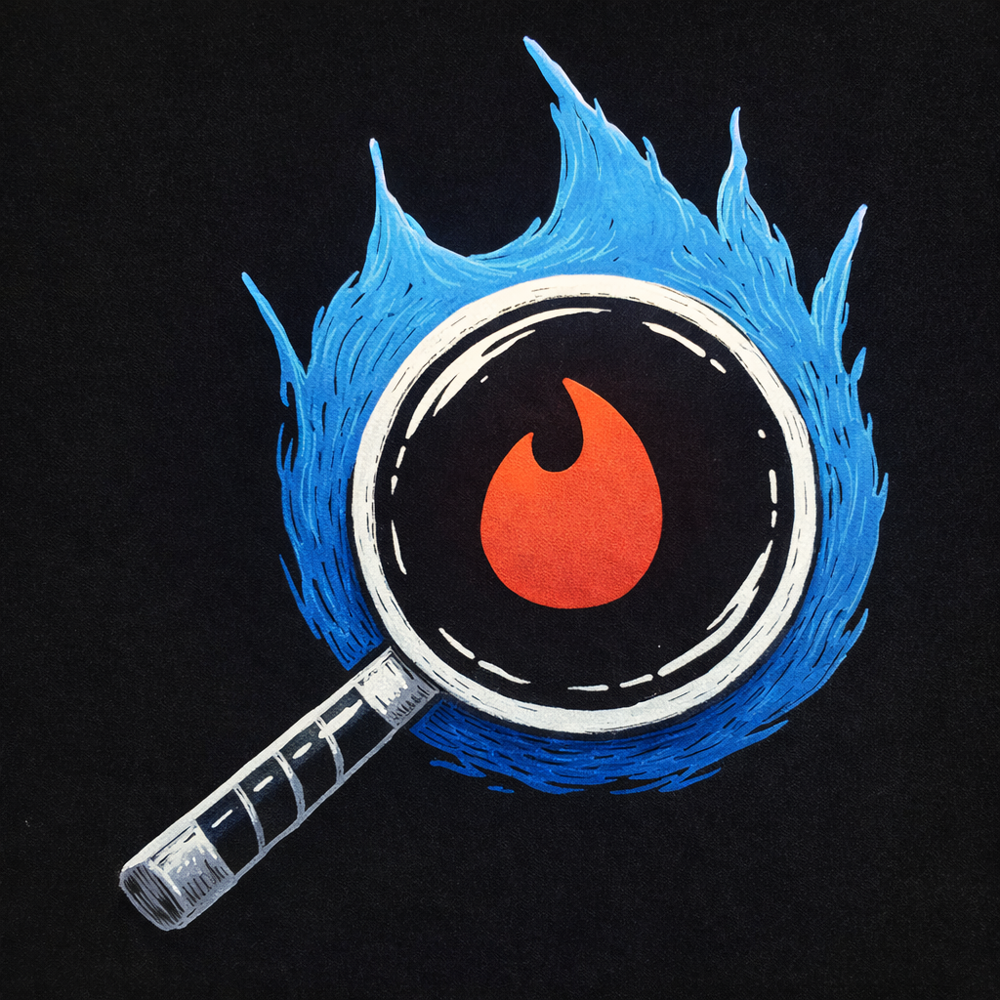

# Tinder Forensica

Tinder Forensica is a browser-based data storytelling project that turns a raw Tinder export into a polished visual narrative. Instead of leaving users with a dense `data.json` archive, it extracts the key relationship funnel, from total swipes to right swipes, matches, and real conversations, and renders the result as a clean portrait SVG insight tree. Being entirely browser based it ensures the privacy of the users data. You can try it in https://overclockedsoul.github.io/tinder_forensica

The application accepts either a Tinder `data.json` export or a `.zip` containing that file, validates the structure in the browser, computes the main engagement metrics, and displays them in a single screen without sending data to any backend. That privacy-first behavior is a core part of the project value: the experience feels lightweight and safe because all parsing happens locally on the user's device.

## What The Project Does

- Converts Tinder export files into a readable visual summary.
- Highlights total swipes, left vs right swipes, matches, and chats.
- Distinguishes between matches that led to conversation and those that did not.
- Uses a custom SVG layout to present the data as a visual progression rather than a plain dashboard.
- Keeps sensitive personal data entirely in the browser.

## Stack

- React 19
- TypeScript
- Vite
- Vitest
- JSZip
